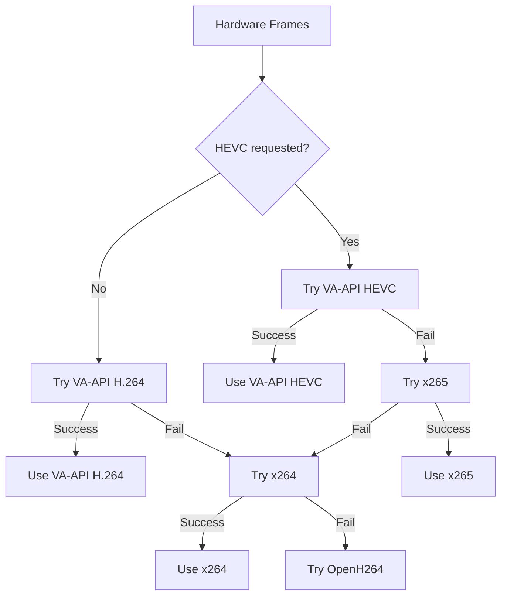
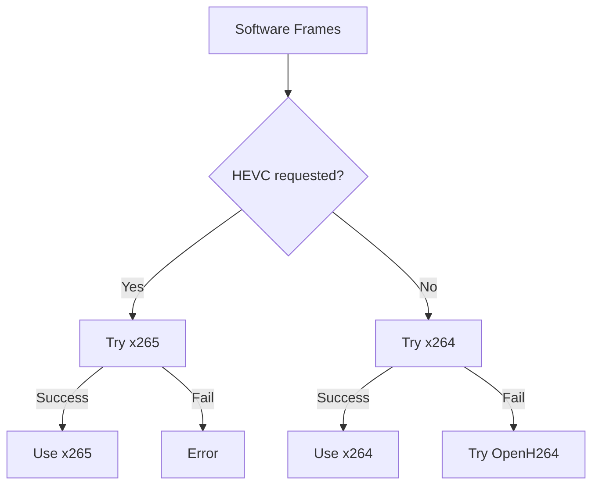

## Overview

ReplaySorcery supports multiple video encoders for different use cases. The encoder you choose affects:

- **Performance**: CPU/GPU usage during recording
- **Quality**: Visual quality of saved replays
- **Compatibility**: Playback support across devices
- **File Size**: Storage requirements

<Note>
The `auto` encoder selection automatically chooses the best available encoder based on your hardware and input method.
</Note>

## Available Encoders

### Configuration

```conf
# In ~/.config/replay-sorcery.conf
videoEncoder = auto  # or x264, x265, openh264, vaapi_h264, vaapi_hevc, hevc
```

## Hardware Encoders (VA-API)

VA-API (Video Acceleration API) encoders use GPU hardware for encoding, providing excellent performance with minimal CPU usage.

<Info>
VA-API encoders are only available when using hardware-accelerated input (`videoInput = hwaccel` or `videoInput = kms_service`).
</Info>

### VA-API H.264 (vah264enc.c)

**Encoder**: `h264_vaapi` via FFmpeg

```conf
videoEncoder = vaapi_h264
```

**Characteristics:**
- **Performance**: ⭐⭐⭐⭐⭐ (Excellent)
- **Quality**: ⭐⭐⭐⭐ (Excellent)
- **Compatibility**: ⭐⭐⭐⭐⭐ (Universal)
- **File Size**: Medium

**Hardware Requirements:**
- Intel HD Graphics 2000 or newer (Sandy Bridge+)
- AMD Radeon HD 6000 or newer (GCN+)
- GPU with VA-API support
- **NOT supported**: NVIDIA proprietary drivers

**Quality Settings:**
```conf
videoEncoder = vaapi_h264
videoQuality = 28        # 1-51, lower is better (default: 28)
videoPreset = fast       # fast, medium, slow
videoProfile = baseline  # baseline, main, high
```

**Rate Control Modes:**
- **Fast preset + quality set**: Uses CQP (Constant Quantization Parameter)
- **Quality + bitrate set**: Uses QVBR (Quality Variable Bitrate)
- **Default**: VBR (Variable Bitrate)

**Filter Pipeline:**
```
hwmap → crop → scale_vaapi → h264_vaapi encoder
```

<Info>
VA-API H.264 is the recommended encoder for most users with supported hardware. It provides the best balance of quality, performance, and compatibility.
</Info>

### VA-API HEVC (vahevcenc.c)

**Encoder**: `hevc_vaapi` via FFmpeg

```conf
videoEncoder = vaapi_hevc
```

**Characteristics:**
- **Performance**: ⭐⭐⭐⭐⭐ (Excellent)
- **Quality**: ⭐⭐⭐⭐⭐ (Excellent)
- **Compatibility**: ⭐⭐⭐ (Modern devices)
- **File Size**: Small

**Hardware Requirements:**
- Intel HD Graphics 6000 or newer (Skylake+)
- AMD Radeon RX 400 or newer
- GPU with HEVC encoding support

**Quality Settings:**
```conf
videoEncoder = vaapi_hevc
videoQuality = 28
videoPreset = fast
```

**Benefits:**
- **Better compression**: ~25-50% smaller files than H.264 at same quality
- **Same GPU usage**: Similar performance to VA-API H.264
- **Future-proof**: Modern codec with growing support

**Drawbacks:**
- **Less compatible**: Not all devices/players support HEVC
- **Patent licensing**: Some platforms require HEVC license
- **Newer hardware required**: Not available on older GPUs

<Warning>
HEVC may not play on all devices. Use H.264 if compatibility is a priority.
</Warning>

## Software Encoders

Software encoders use CPU for encoding. They're available on all systems but use more CPU than hardware encoders.

### x264 (x264enc.c)

**Encoder**: `libx264` via FFmpeg

```conf
videoEncoder = x264
```

**Characteristics:**
- **Performance**: ⭐⭐⭐ (Good)
- **Quality**: ⭐⭐⭐⭐⭐ (Excellent)
- **Compatibility**: ⭐⭐⭐⭐⭐ (Universal)
- **File Size**: Medium

**CPU Usage**: 15-25% (1080p60, ultrafast preset)

**Quality Settings:**
```conf
videoEncoder = x264
videoQuality = 28        # CRF value (18=high quality, 28=balanced, 35=low quality)
videoPreset = fast       # fast=ultrafast, medium=medium, slow=slower
videoProfile = baseline  # baseline, main, high
videoBitrate = auto      # Optional max bitrate (e.g., 5M)
```

**Preset Mapping:**
- **fast** → `ultrafast`: Fastest encoding, lower compression efficiency
- **medium** → `medium`: Balanced speed and compression
- **slow** → `slower`: Better compression, higher CPU usage

**Rate Control:**
- **CRF mode** (default): Constant quality, variable bitrate
- **CRF + bitrate**: CRF with max bitrate cap
- **Fast preset + quality**: Uses QP (Quantization Parameter) mode

**Filter Pipeline:**
```
scale → format (yuv420p) → libx264 encoder
```

<Info>
x264 is the recommended software encoder. It's mature, fast, and produces excellent quality at low bitrates.
</Info>

### x265 (x265enc.c)

**Encoder**: `libx265` via FFmpeg

```conf
videoEncoder = x265
```

**Characteristics:**
- **Performance**: ⭐⭐ (Fair)
- **Quality**: ⭐⭐⭐⭐⭐ (Excellent)
- **Compatibility**: ⭐⭐⭐ (Modern devices)
- **File Size**: Small

**CPU Usage**: 25-35% (1080p60, ultrafast preset)

**Quality Settings:**
```conf
videoEncoder = x265
videoQuality = 28
videoPreset = fast  # fast=ultrafast, medium=medium, slow=slower
```

**Benefits:**
- **Better compression**: 25-50% smaller files than x264
- **High quality**: Excellent visual quality at low bitrates
- **No hardware required**: Works on any CPU

**Drawbacks:**
- **Higher CPU usage**: 50-100% more CPU than x264
- **Slower encoding**: May drop frames on slower CPUs
- **Less compatible**: Not supported on all devices

**When to use:**
- Storage space is limited
- You have a powerful CPU (8+ cores recommended)
- Encoding quality > real-time performance
- Target devices support HEVC

### OpenH264 (openh264enc.c)

**Encoder**: `libopenh264` via FFmpeg

```conf
videoEncoder = openh264
```

**Characteristics:**
- **Performance**: ⭐⭐⭐⭐ (Good)
- **Quality**: ⭐⭐⭐ (Good)
- **Compatibility**: ⭐⭐⭐⭐ (High)
- **File Size**: Medium-Large

**CPU Usage**: 20-30% (1080p60)

**Quality Settings:**
```conf
videoEncoder = openh264
videoQuality = 28        # Controls qmax/qmin
videoPreset = fast       # Affects loop filter and coder
```

**Preset Behavior:**
- **fast**: Disables loop filter, uses CAVLC coder
- **medium**: Uses CAVLC coder
- **slow**: Uses CABAC coder (better compression)

**Special Features:**
- **Cisco license**: Royalty-free H.264 encoding (Cisco pays fees)
- **Fallback encoder**: Used when x264 is unavailable
- **Single slice**: Optimized for streaming

**Limitations:**
- **Baseline profile only**: OpenH264 forces Constrained Baseline profile
- **Lower quality**: Not as good as x264 at same bitrate
- **Limited tuning**: Fewer optimization options

<Note>
OpenH264 is primarily used as a fallback when x264 is not available. Most users should prefer x264.
</Note>

## Encoder Selection Logic

When `videoEncoder = auto`, ReplaySorcery selects encoders in this order:

### Hardware Input (KMS/hwaccel)



**Priority:**
1. VA-API HEVC (if `videoEncoder = hevc`)
2. VA-API H.264 (default for hardware input)
3. x265 (if VA-API fails and HEVC requested)
4. x264 (primary software fallback)
5. OpenH264 (final fallback)

### Software Input (X11)



**Priority:**
1. x265 (if `videoEncoder = hevc`)
2. x264 (default for software input)
3. OpenH264 (fallback)

## Performance Comparison

### Encoding Performance (1080p60)

| Encoder | CPU Usage | GPU Usage | Quality | File Size | Real-time |
|---------|-----------|-----------|---------|-----------|------------|
| VA-API H.264 | ~5% | ~30% | Excellent | 100% | ✅ Yes |
| VA-API HEVC | ~5% | ~30% | Excellent | 60% | ✅ Yes |
| x264 (fast) | ~15-25% | 0% | Excellent | 100% | ✅ Yes |
| x265 (fast) | ~25-35% | 0% | Excellent | 65% | ⚠️ Maybe |
| OpenH264 | ~20-30% | 0% | Good | 120% | ✅ Yes |

<Info>
File sizes are relative to x264 at the same quality level. Actual sizes depend on content complexity and quality settings.
</Info>

## Quality Settings

### Video Quality (CRF)

```conf
videoQuality = 28  # 1-51 for most encoders
```

**Recommended values:**
- **18**: Near-lossless (very large files)
- **23**: High quality (perceptually lossless)
- **28**: Balanced (default, good quality)
- **32**: Lower quality (smaller files)
- **35**: Low quality (very small files)

### Video Preset

```conf
videoPreset = fast  # fast, medium, slow
```

**Performance vs Quality:**
- **fast**: Fastest encoding, lower compression efficiency, real-time on most CPUs
- **medium**: Balanced, may struggle on slower CPUs
- **slow**: Better compression, requires powerful CPU, may drop frames

<Warning>
Use `fast` preset for recording. Slower presets may cause frame drops during gameplay.
</Warning>

### Video Profile

```conf
videoProfile = baseline  # baseline, main, high
```

**Compatibility:**
- **baseline**: Maximum compatibility (older devices, web browsers)
- **main**: Modern devices, better compression
- **high**: Best quality, requires modern hardware

## Choosing an Encoder

### Decision Tree

<Steps>
  <Step title="Check Hardware Support">
    ```bash
    # Check VA-API support
    vainfo
    
    # If you see H.264/HEVC encoders, you have hardware support
    ```
    
    - **VA-API available** → Use `vaapi_h264` or `vaapi_hevc`
    - **No VA-API** → Use software encoder
  </Step>
  
  <Step title="Choose Codec">
    **H.264 vs HEVC:**
    
    - **Compatibility priority** → H.264
    - **File size priority** → HEVC
    - **Unsure** → H.264 (safer choice)
  </Step>
  
  <Step title="Select Specific Encoder">
    **With hardware acceleration:**
    ```conf
    videoInput = kms_service
    videoEncoder = vaapi_h264  # or vaapi_hevc
    ```
    
    **Without hardware acceleration:**
    ```conf
    videoInput = x11
    videoEncoder = x264  # or x265 if you have CPU power
    ```
  </Step>
  
  <Step title="Tune Quality Settings">
    ```conf
    videoQuality = 28  # Lower = better quality
    videoPreset = fast  # Don't use slow for recording
    ```
  </Step>
</Steps>

### Quick Recommendations

<Tabs>
  <Tab title="Best Quality">
    ```conf
    # Hardware acceleration if available
    videoInput = kms_service
    videoEncoder = vaapi_hevc  # or vaapi_h264
    videoQuality = 23
    videoPreset = medium
    ```
  </Tab>
  <Tab title="Best Performance">
    ```conf
    # Hardware acceleration is essential
    videoInput = kms_service
    videoEncoder = vaapi_h264
    videoQuality = 28
    videoPreset = fast
    ```
  </Tab>
  <Tab title="Smallest Files">
    ```conf
    videoInput = kms_service
    videoEncoder = vaapi_hevc  # or x265
    videoQuality = 28
    videoPreset = medium
    ```
  </Tab>
  <Tab title="Maximum Compatibility">
    ```conf
    videoEncoder = x264
    videoProfile = baseline
    videoQuality = 28
    videoPreset = fast
    ```
  </Tab>
</Tabs>

## Troubleshooting

### Encoder Not Found

```bash
# Check available encoders
ffmpeg -encoders | grep -E "h264|hevc|x264|x265|openh264|vaapi"

# If missing:
# - Install FFmpeg with encoder support
# - Install x264/x265 libraries
# - Install VA-API drivers
```

### Low Quality / Blocky Video

```conf
# Reduce quality number (counter-intuitive!)
videoQuality = 23  # Lower = better

# Or increase bitrate
videoBitrate = 5M
```

### Dropped Frames / Lag

```conf
# Use faster preset
videoPreset = fast

# Or lower framerate
videoFramerate = 30

# Or reduce resolution
scaleWidth = 1280
scaleHeight = 720
```

### "Failed to create encoder"

```bash
# Check service logs
journalctl --user -u replay-sorcery -n 50

# Common causes:
# 1. VA-API requested but not available → use software encoder
# 2. HEVC requested but not supported → use H.264
# 3. Hardware frames but software encoder → matches input/encoder type
```

## Implementation Details

### Source Files

- **encoder.c** (src/encoder/encoder.c:26): Encoder selection logic
- **x264enc.c** (src/encoder/x264enc.c:25): x264 implementation
- **x265enc.c** (src/encoder/x265enc.c:25): x265 implementation  
- **openh264enc.c** (src/encoder/openh264enc.c:25): OpenH264 implementation
- **vah264enc.c** (src/encoder/vah264enc.c:25): VA-API H.264 implementation
- **vahevcenc.c** (src/encoder/vahevcenc.c:25): VA-API HEVC implementation
- **ffenc.c** (src/encoder/ffenc.c:1): FFmpeg encoder wrapper

### Encoder Creation Flow

```c
// From encoder.c
int rsVideoEncoderCreate(RSEncoder *encoder, 
                         const AVCodecParameters *params,
                         const AVBufferRef *hwFrames) {
    // 1. Check explicit encoder selection
    switch (rsConfig.videoEncoder) {
        case RS_CONFIG_ENCODER_X264:
            return rsX264EncoderCreate(encoder, params);
        case RS_CONFIG_ENCODER_VAAPI_H264:
            return rsVaapiH264EncoderCreate(encoder, params, hwFrames);
        // ... etc
    }
    
    // 2. Auto-detect based on hardware frames
    if (hwFrames != NULL) {
        // Try VA-API encoders
        if (rsVaapiH264EncoderCreate(...) >= 0) {
            return 0;  // Success
        }
    }
    
    // 3. Fall back to software encoders
    if (rsX264EncoderCreate(...) >= 0) {
        return 0;
    }
    
    return AVERROR(ENOSYS);  // No encoder available
}
```

## Next Steps

<CardGroup cols={2}>
  <Card title="Configuration Guide" icon="sliders" href="/configuration/overview">
    Full reference for video quality and encoder settings
  </Card>
  <Card title="Hardware Acceleration" icon="rocket" href="/advanced/hardware-acceleration">
    Enable VA-API for optimal performance
  </Card>
  <Card title="KMS Service" icon="gear" href="/advanced/kms-service">
    Set up the KMS service for hardware encoding
  </Card>
  <Card title="Troubleshooting" icon="wrench" href="/troubleshooting/common-issues">
    Get help with common issues
  </Card>
</CardGroup>